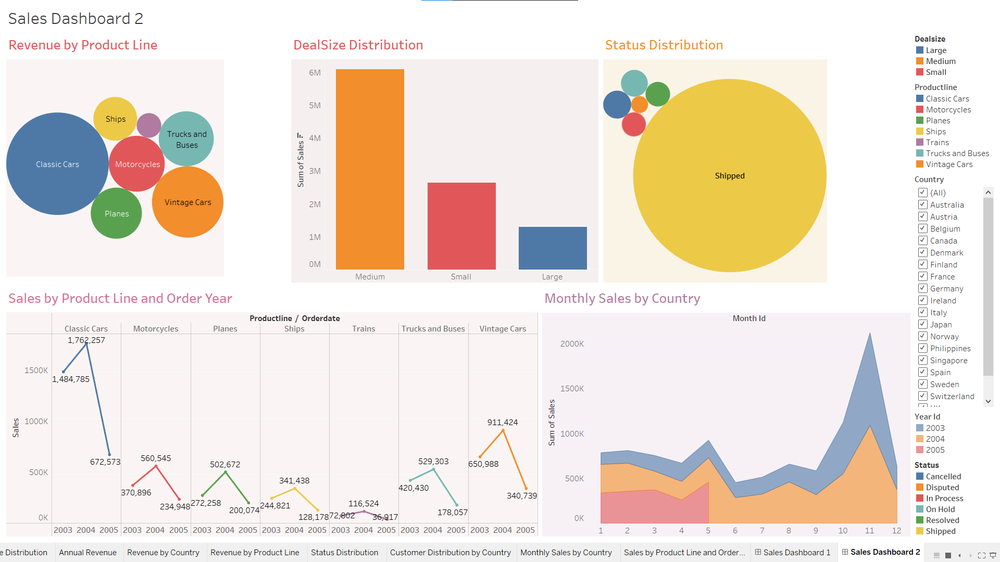

# Sales Data Analysis
This project focuses on analyzing sales data to derive actionable insights using SQL for data extraction and manipulation, and Tableau for visualization. The analysis encompasses various aspects such as product performance, customer segmentation, sales trends, and geographical analysis, providing a comprehensive overview of the sales landscape.
## Features
- Data Inspection and Cleaning: SQL queries are used to inspect and clean the dataset, ensuring accurate and reliable analysis by identifying unique values and grouping data by relevant dimensions.
- Exploratory Data Analysis (EDA): SQL is employed to perform detailed exploratory analysis, such as grouping sales by product line, deal size, and year, as well as identifying the best months for sales and the top-performing products.
- Customer Segmentation: An RFM (Recency, Frequency, Monetary) analysis is conducted using SQL to segment customers into various categories, such as loyal customers, potential churners, and new customers, helping businesses target their marketing strategies effectively.
- Product Affinity Analysis: SQL is used to identify products that are frequently sold together, providing insights for cross-selling opportunities.
- Geographical Analysis: The project includes a geographical breakdown of sales, identifying top-performing cities within specific countries using SQL.
- Visualization: Tableau is utilized to create interactive dashboards that visualize key insights from the SQL analysis, making it easier to understand and communicate the results.
## Screeshots

## Tools Used
- SQL: For data extraction, cleaning, and analysis.
- Tableau: For creating interactive visualizations and dashboards.
